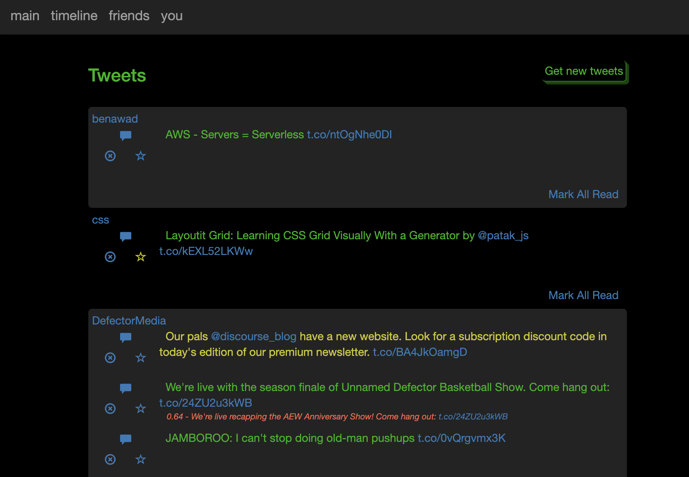
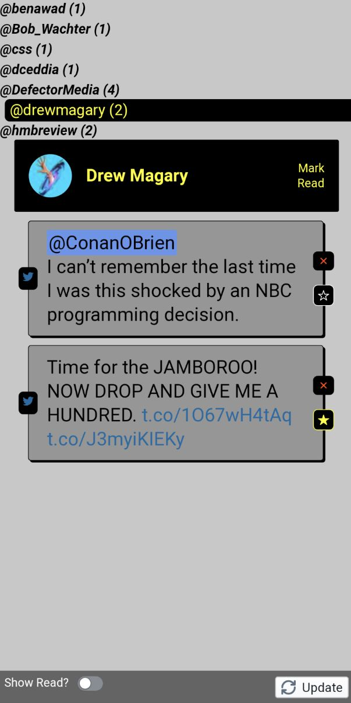

## An alternative Twitter client inspired by Google Reader. 

### What?
Twitter timeline is retrieved and stored locally, then presented in a more useful way.

### Why?
In the good old days of RSS, we had tools like Google Reader to subscribe to content feeds that we found interesting. It provided an efficient way to follow a bunch of different news sources and click into stories you wanted to read. Then Twitter showed up and made it simple for anyone to become one of those news sources, and that was good. But Twitter does a poor job of organizing that content for you, and instead does a very good job of making you spend a lot of time sifting through your timeline looking for the subset of tweets you care about. The more people you follow, the harder it gets -- especially if you follow any particularly chatty users or those that tweet the same headlines multiple times in order to combat timeline fatigue.

I want a presentation that:
* groups tweets by user 
* remembers the tweets I've already seen 
* has keyboard navigation
* makes it simple to dismiss the tweets I'm done with or an entire rant thread that I don't care aobut
* identifies and filters out duplicate tweets 

### How?
* Currently this only supports a single user, authorized by a Twitter application key & user access token. Get those from https://apps.twitter.com/, and put them into environment variables. See `env.sample` for the required vars.
* Data is stored in MongoDB. Specify the connection string in `MONGODB_URI`
